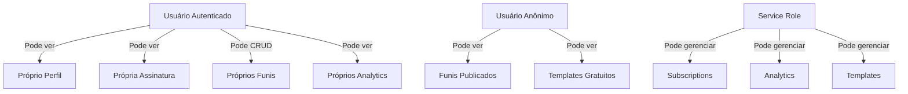
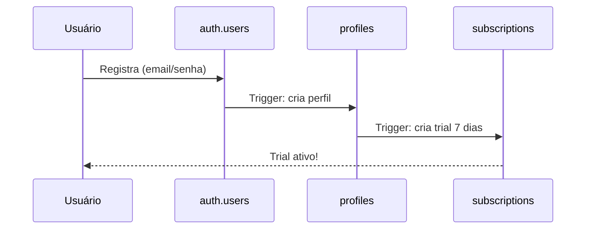
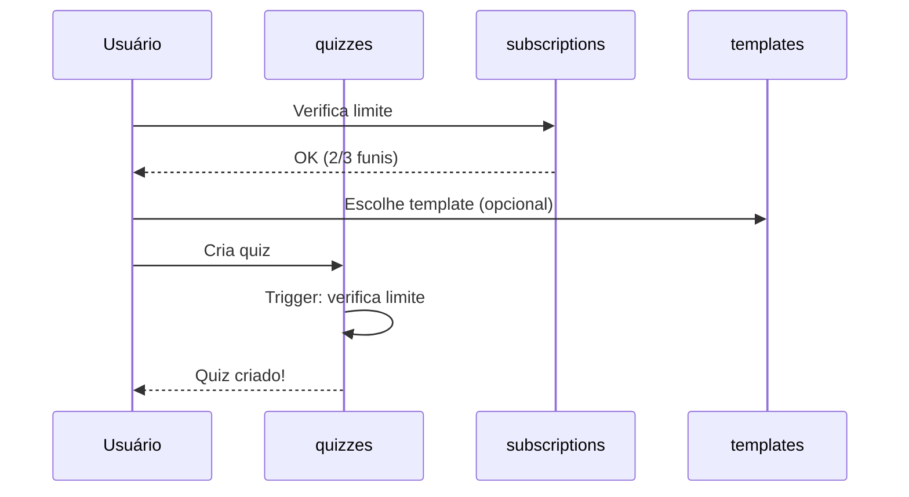
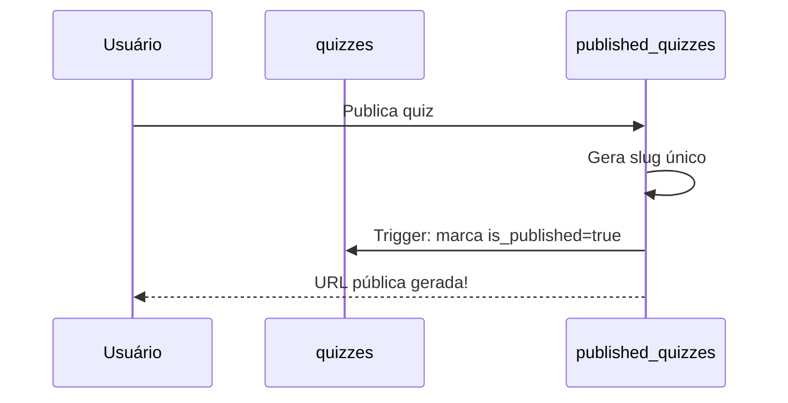
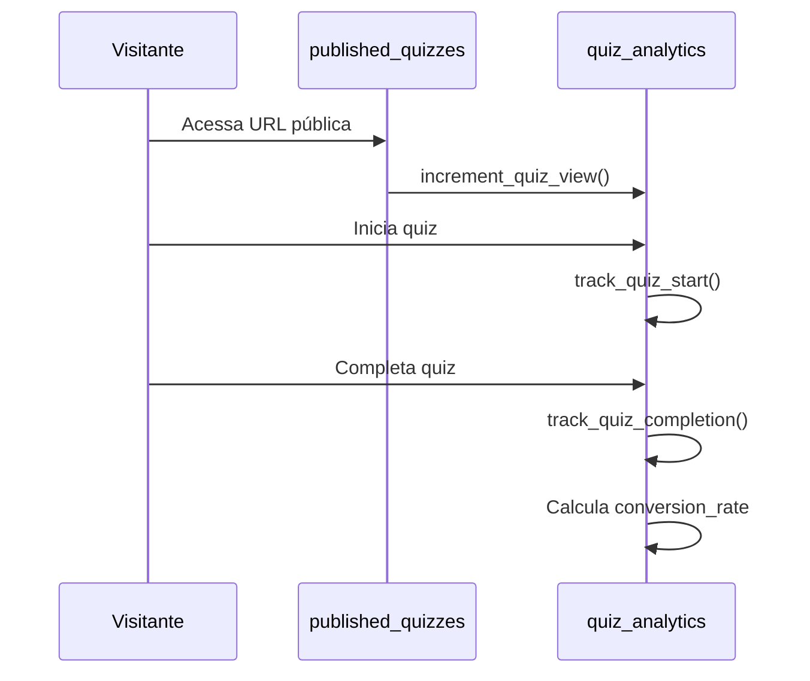

# 📊 Estrutura do Banco de Dados - XQuiz

## Visão Geral

O banco de dados do XQuiz foi projetado para suportar um sistema SaaS completo de criação de funis interativos, com controle de assinaturas, analytics e templates premium.

---

## 🗂️ Tabelas

### 1. `profiles`
**Propósito**: Perfis de usuários estendendo `auth.users`

| Coluna | Tipo | Descrição |
|--------|------|-----------|
| `id` | UUID | PK, referencia `auth.users.id` |
| `email` | TEXT | Email do usuário |
| `full_name` | TEXT | Nome completo |
| `avatar_url` | TEXT | URL do avatar |
| `created_at` | TIMESTAMP | Data de criação |
| `updated_at` | TIMESTAMP | Última atualização |

**Triggers**:
- ✅ Criação automática ao registrar usuário
- ✅ Atualização automática de `updated_at`

**RLS**: Usuários veem apenas seu próprio perfil

---

### 2. `subscriptions`
**Propósito**: Gerenciamento de assinaturas e planos

| Coluna | Tipo | Descrição |
|--------|------|-----------|
| `id` | UUID | PK |
| `user_id` | UUID | FK para `profiles` |
| `plan_type` | ENUM | 'basic', 'pro', 'black' |
| `status` | ENUM | 'active', 'cancelled', 'expired', 'trial' |
| `kiwify_subscription_id` | TEXT | ID da Kiwify |
| `kiwify_customer_id` | TEXT | Cliente na Kiwify |
| `kiwify_data` | JSONB | Dados completos do webhook |
| `expires_at` | TIMESTAMP | Data de expiração |
| `trial_ends_at` | TIMESTAMP | Fim do trial |
| `max_quizzes` | INTEGER | Limite de funis |
| `max_monthly_views` | INTEGER | Limite de acessos/mês |

**Limites por Plano**:
- **Basic**: 3 funis, 10.000 views/mês
- **Pro**: 10 funis, 50.000 views/mês
- **Black**: 25 funis, 100.000 views/mês

**Triggers**:
- ✅ Trial de 7 dias criado automaticamente
- ✅ Limites definidos automaticamente pelo plano

**RLS**: Usuários veem apenas suas assinaturas

---

### 3. `quizzes`
**Propósito**: Funis criados pelos usuários

| Coluna | Tipo | Descrição |
|--------|------|-----------|
| `id` | UUID | PK |
| `user_id` | UUID | FK para `profiles` |
| `template_id` | UUID | FK para `templates` (nullable) |
| `title` | TEXT | Título do funil |
| `description` | TEXT | Descrição |
| `quiz_data` | JSONB | Estrutura completa (questions, etc.) |
| `theme_color` | TEXT | Cor do tema |
| `avatar` | TEXT | Avatar/emoji |
| `settings` | JSONB | Webhooks, pixels, etc. |
| `is_published` | BOOLEAN | Se está publicado |
| `is_deleted` | BOOLEAN | Soft delete |
| `deleted_at` | TIMESTAMP | Quando foi deletado |

**Triggers**:
- ✅ Verificação automática de limite de funis
- ✅ Soft delete (não apaga, apenas marca)

**RLS**: Usuários veem apenas seus funis não-deletados

---

### 4. `published_quizzes`
**Propósito**: Funis publicados com URLs públicas

| Coluna | Tipo | Descrição |
|--------|------|-----------|
| `id` | UUID | PK |
| `quiz_id` | UUID | FK para `quizzes` (unique) |
| `user_id` | UUID | FK para `profiles` |
| `slug` | TEXT | URL única (ex: 'meu-quiz-123') |
| `custom_domain` | TEXT | Domínio personalizado (opcional) |
| `is_active` | BOOLEAN | Se está ativo |
| `published_at` | TIMESTAMP | Data de publicação |

**Funções**:
- ✅ Geração automática de slug único
- ✅ Sincronização com `quizzes.is_published`

**RLS**: 
- Leitura pública para funis ativos
- Apenas donos podem gerenciar

---

### 5. `quiz_analytics`
**Propósito**: Estatísticas de performance dos funis

| Coluna | Tipo | Descrição |
|--------|------|-----------|
| `id` | UUID | PK |
| `quiz_id` | UUID | FK para `quizzes` |
| `analytics_date` | DATE | Data (agregação diária) |
| `total_views` | INTEGER | Total de visualizações |
| `total_starts` | INTEGER | Quantos começaram |
| `total_completions` | INTEGER | Quantos completaram |
| `unique_visitors` | INTEGER | Visitantes únicos |
| `conversion_rate` | DECIMAL | Taxa de conversão (%) |
| `completion_rate` | DECIMAL | Taxa de conclusão (%) |
| `average_time_seconds` | INTEGER | Tempo médio |
| `step_analytics` | JSONB | Analytics por etapa |
| `device_breakdown` | JSONB | Por dispositivo |

**Funções**:
- ✅ `increment_quiz_view()` - Rastrear visualização
- ✅ `track_quiz_start()` - Rastrear início
- ✅ `track_quiz_completion()` - Rastrear conclusão
- ✅ `check_monthly_views_limit()` - Verificar limite

**RLS**: Apenas donos veem analytics

---

### 6. `templates`
**Propósito**: Templates de funis (gratuitos e premium)

| Coluna | Tipo | Descrição |
|--------|------|-----------|
| `id` | UUID | PK |
| `name` | TEXT | Nome do template |
| `description` | TEXT | Descrição |
| `category` | TEXT | Categoria/nicho |
| `thumbnail_url` | TEXT | Imagem de preview |
| `template_data` | JSONB | Estrutura completa do quiz |
| `is_premium` | BOOLEAN | Se é premium |
| `required_plan` | ENUM | Plano mínimo necessário |
| `is_active` | BOOLEAN | Se está ativo |
| `usage_count` | INTEGER | Vezes usado |

**Templates Pré-carregados**:
- ✅ Quiz Básico (gratuito)
- ✅ Quiz com Personagem (gratuito)

**RLS**: 
- Templates gratuitos: acesso público
- Templates premium: apenas para planos adequados

---

## 🔐 Segurança (Row Level Security)

Todas as tabelas possuem RLS habilitado:



---

## 🔄 Fluxo de Dados

### Registro de Novo Usuário



### Criação de Quiz



### Publicação de Quiz



### Rastreamento de Analytics



---

## 📈 Funções Úteis

### Verificar Assinatura do Usuário
```sql
SELECT * FROM get_user_subscription('user-id-here');
```

### Verificar Limite de Funis
```sql
SELECT check_quiz_limit('user-id-here');
```

### Obter Contagem de Funis
```sql
SELECT * FROM get_user_quiz_count('user-id-here');
```

### Verificar Limite de Views Mensais
```sql
SELECT * FROM check_monthly_views_limit('user-id-here');
```

### Obter Quiz Publicado
```sql
SELECT * FROM get_published_quiz('meu-quiz-123');
```

### Obter Templates Disponíveis
```sql
SELECT * FROM get_available_templates('user-id-here');
```

### Rastrear View
```sql
SELECT increment_quiz_view('quiz-id', 'mobile', 'facebook.com');
```

### Obter Analytics
```sql
SELECT * FROM get_quiz_analytics_summary(
    'quiz-id',
    '2025-01-01'::date,
    '2025-01-31'::date
);
```

---

## 🎯 Índices para Performance

Todos os índices importantes já estão criados:

- ✅ Índices em FKs (user_id, quiz_id, etc.)
- ✅ Índices em campos de busca (slug, email, etc.)
- ✅ Índices compostos (quiz_id + analytics_date)
- ✅ GIN indexes para JSONB (quiz_data, settings, etc.)

---

## 💾 Backup e Manutenção

### Backup Automático
O Supabase faz backup automático diário no plano pago.

### Limpeza de Dados Antigos
Considere criar um job para:
- Deletar analytics com mais de 1 ano
- Deletar permanentemente funis com `is_deleted=true` há mais de 30 dias

```sql
-- Exemplo de limpeza (rodar mensalmente)
DELETE FROM quiz_analytics 
WHERE analytics_date < CURRENT_DATE - INTERVAL '1 year';

DELETE FROM quizzes 
WHERE is_deleted = TRUE 
AND deleted_at < CURRENT_DATE - INTERVAL '30 days';
```

---

## 🚀 Próximos Passos

1. ✅ Executar migrations no Supabase
2. ⏳ Criar tipos TypeScript
3. ⏳ Criar serviços de banco de dados
4. ⏳ Atualizar componentes
5. ⏳ Configurar webhook da Kiwify
6. ⏳ Testar fluxo completo

---

## 📚 Referências

- [Documentação Supabase](https://supabase.com/docs)
- [Row Level Security](https://supabase.com/docs/guides/auth/row-level-security)
- [PostgreSQL JSONB](https://www.postgresql.org/docs/current/datatype-json.html)
