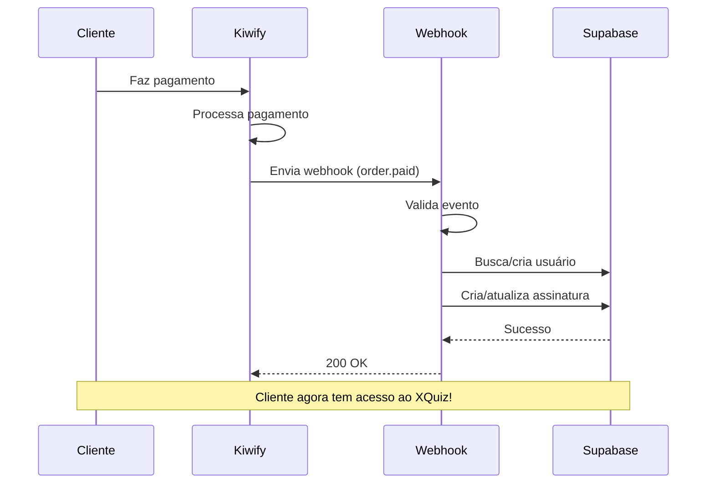

# 🔗 Integração com Kiwify - Guia Completo

## 📋 Visão Geral

Este guia explica como configurar a integração completa entre o XQuiz e a Kiwify para processar pagamentos automaticamente.


---

## ✅ O Que Já Foi Criado

### Arquivos de Integração

1. **[kiwify.config.ts](file:///c:/Users/ear/OneDrive/Documentos/FUNIL%20AFILIADOS/config/kiwify.config.ts)** - Configuração e credenciais
2. **[kiwify.types.ts](file:///c:/Users/ear/OneDrive/Documentos/FUNIL%20AFILIADOS/types/kiwify.types.ts)** - Tipos TypeScript
3. **[kiwify.service.ts](file:///c:/Users/ear/OneDrive/Documentos/FUNIL%20AFILIADOS/services/kiwify.service.ts)** - Lógica de processamento
4. **[api/webhooks/kiwify.ts](file:///c:/Users/ear/OneDrive/Documentos/FUNIL%20AFILIADOS/api/webhooks/kiwify.ts)** - Endpoint do webhook

### Eventos Processados

- ✅ `order.paid` - Pagamento aprovado → Cria assinatura
- ✅ `order.refunded` - Reembolso → Cancela assinatura
- ✅ `subscription.started` - Assinatura iniciada
- ✅ `subscription.cancelled` - Assinatura cancelada
- ✅ `subscription.expired` - Assinatura expirada

---

## 🔧 Configuração Passo a Passo

### 1️⃣ Configurar Variáveis de Ambiente

Adicione as credenciais da Kiwify no seu arquivo `.env.local`:

```env
# Kiwify (suas credenciais)
KIWIFY_CLIENT_SECRET=eefbf041436399 4c1c9bffa04f19868bfd206602a5f7629fde8f15523
KIWIFY_CLIENT_ID=e558533b-cef9-4075-b10d-3f94a685b073
KIWIFY_ACCOUNT_ID=jq987acP3BtaLRw
KIWIFY_WEBHOOK_SECRET=seu-webhook-secret-aqui

# Supabase Service Role (para bypass RLS)
SUPABASE_SERVICE_ROLE_KEY=sua-service-role-key-aqui
```

> ⚠️ **IMPORTANTE**: O `SUPABASE_SERVICE_ROLE_KEY` é necessário para o webhook atualizar assinaturas sem autenticação de usuário.

---

### 2️⃣ Mapear Produtos para Planos

Edite o arquivo [kiwify.config.ts](file:///c:/Users/ear/OneDrive/Documentos/FUNIL%20AFILIADOS/config/kiwify.config.ts):

```typescript
export const KIWIFY_PRODUCT_PLANS = {
  // Substitua pelos IDs REAIS dos seus produtos na Kiwify
  'produto-id-basic-mensal': 'basic',
  'produto-id-basic-anual': 'basic',
  'produto-id-pro-mensal': 'pro',
  'produto-id-pro-anual': 'pro',
  'produto-id-black-mensal': 'black',
  'produto-id-black-anual': 'black',
} as const;
```

**Como encontrar o ID do produto:**
1. Acesse https://dashboard.kiwify.com.br
2. Vá em "Produtos"
3. Clique no produto
4. O ID está na URL: `dashboard.kiwify.com.br/products/SEU-PRODUTO-ID`

---

### 3️⃣ Deploy do Webhook

O webhook precisa estar em produção para a Kiwify enviar eventos.

#### Opção A: Vercel (Recomendado)

1. Instale a CLI da Vercel:
```bash
npm install -g vercel
```

2. Deploy:
```bash
vercel
```

3. Sua URL será algo como: `https://seu-projeto.vercel.app`

4. O endpoint do webhook será: `https://seu-projeto.vercel.app/api/webhooks/kiwify`

#### Opção B: Netlify

1. Renomeie `api/webhooks/kiwify.ts` para `netlify/functions/kiwify-webhook.ts`

2. Deploy:
```bash
netlify deploy --prod
```

3. O endpoint será: `https://seu-site.netlify.app/.netlify/functions/kiwify-webhook`

---

### 4️⃣ Configurar Webhook na Kiwify

1. Acesse https://dashboard.kiwify.com.br
2. Vá em **Configurações** → **Webhooks**
3. Clique em **"Adicionar Webhook"**
4. Preencha:
   - **URL**: `https://seu-projeto.vercel.app/api/webhooks/kiwify`
   - **Eventos**: Selecione todos:
     - ✅ Pedido pago (order.paid)
     - ✅ Pedido reembolsado (order.refunded)
     - ✅ Assinatura iniciada (subscription.started)
     - ✅ Assinatura cancelada (subscription.cancelled)
     - ✅ Assinatura expirada (subscription.expired)
5. Clique em **"Salvar"**

---

### 5️⃣ Testar Localmente (Opcional)

Para testar o webhook localmente antes do deploy:

1. Instale ngrok:
```bash
npm install -g ngrok
```

2. Rode seu projeto:
```bash
npm run dev
```

3. Em outro terminal, exponha a porta:
```bash
ngrok http 5173
```

4. Use a URL do ngrok na Kiwify: `https://xxxxx.ngrok.io/api/webhooks/kiwify`

5. Faça um teste de compra na Kiwify

6. Verifique os logs no terminal

---

## 🔄 Fluxo de Integração



---

## 📊 Dados Salvos no Banco

Quando um pagamento é processado, o sistema:

1. **Cria ou busca o usuário** na tabela `profiles`
2. **Cria a assinatura** na tabela `subscriptions` com:
   - `plan_type`: 'basic', 'pro' ou 'black'
   - `status`: 'active'
   - `kiwify_subscription_id`: ID da assinatura na Kiwify
   - `kiwify_customer_id`: ID do cliente
   - `expires_at`: Data de expiração
   - `kiwify_data`: Dados completos do webhook (para debug)

---

## 🧪 Testar a Integração

### Teste 1: Pagamento Aprovado

1. Faça uma compra de teste na Kiwify
2. Verifique os logs do webhook
3. Confira no Supabase:
   - Tabela `profiles` → novo usuário criado
   - Tabela `subscriptions` → assinatura ativa

### Teste 2: Cancelamento

1. Cancele a assinatura na Kiwify
2. Verifique no Supabase:
   - `subscriptions.status` → 'cancelled'
   - `subscriptions.cancelled_at` → data atual

### Teste 3: Login do Usuário

1. Tente fazer login com o email do cliente
2. Verifique que ele tem acesso aos recursos do plano

---

## 🐛 Troubleshooting

### Webhook não está sendo chamado

- ✅ Verifique se a URL está correta na Kiwify
- ✅ Certifique-se que o projeto está em produção (não localhost)
- ✅ Verifique os logs da Kiwify em "Webhooks" → "Histórico"

### Erro 500 no webhook

- ✅ Verifique as variáveis de ambiente
- ✅ Confira se `SUPABASE_SERVICE_ROLE_KEY` está configurada
- ✅ Veja os logs no Vercel/Netlify

### Assinatura não é criada

- ✅ Verifique se o `product_id` está mapeado em `kiwify.config.ts`
- ✅ Confira os logs do webhook
- ✅ Verifique se as migrations do Supabase foram executadas

### Usuário não consegue fazer login

- ✅ Verifique se o email foi confirmado automaticamente
- ✅ Confira se o usuário foi criado em `auth.users`
- ✅ Verifique se o perfil foi criado em `profiles`

---

## 📝 Logs e Monitoramento

### Ver logs do webhook

**Vercel:**
```bash
vercel logs
```

**Netlify:**
- Acesse o dashboard → Functions → Ver logs

### Logs importantes

O webhook registra:
- ✅ Evento recebido
- ✅ Usuário criado/encontrado
- ✅ Assinatura criada/atualizada
- ❌ Erros de processamento

---

## 🔐 Segurança

### Validação de Assinatura

O webhook valida a assinatura da Kiwify para garantir que os eventos são legítimos:

```typescript
const signature = req.headers.get('x-kiwify-signature');
const isValid = validateWebhookSignature(payload, signature, secret);
```

### Service Role Key

O `SUPABASE_SERVICE_ROLE_KEY` permite ao webhook atualizar o banco sem autenticação. **NUNCA exponha essa chave no frontend!**

---

## ✅ Checklist Final

Antes de ir para produção:

- [ ] Variáveis de ambiente configuradas
- [ ] Produtos mapeados em `kiwify.config.ts`
- [ ] Webhook deployado em produção
- [ ] URL configurada na Kiwify
- [ ] Teste de compra realizado
- [ ] Assinatura criada no Supabase
- [ ] Login do cliente funcionando
- [ ] Teste de cancelamento realizado

---

## 🚀 Próximos Passos

Após a integração funcionar:

1. **Criar página de checkout** personalizada
2. **Implementar área de gerenciamento** de assinatura
3. **Adicionar emails transacionais** (boas-vindas, cancelamento, etc.)
4. **Configurar analytics** de conversão
5. **Criar dashboard** de métricas de vendas

---

**Dúvidas? Precisa de ajuda para configurar? Me avise!** 🚀
